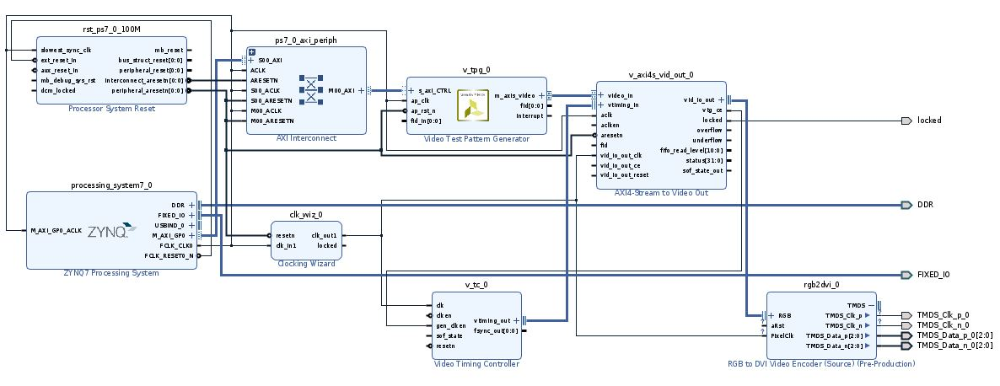
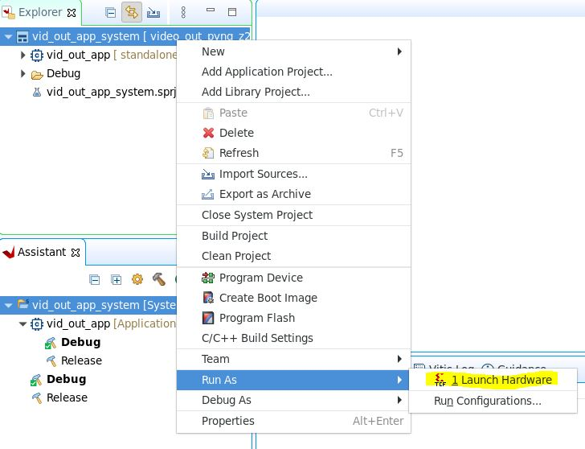
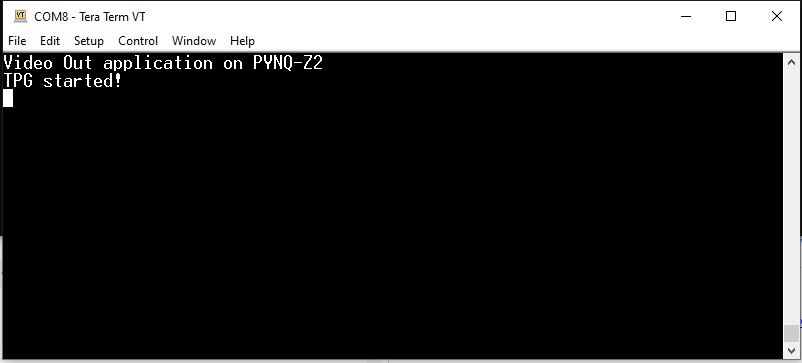

# Pynq-Z2-Video (v0.3)

## Requirement
This version of the design requires:
* Vivado 2023.2 with the PYNQ-Z2 board file installed
* Vitis Unified IDE 2023.2

## Introduction

This design is a simple design to generate a video output on the HDMI TX connector of the PYNQ-Z2 board. The output resolution can be switched between multiple resolutions (1280x720@60Hz, 1024x768@60Hz, 800x600@60Hz, 640x480@60Hz)

## Vivado design

The Vivado design is shown below.


It includes the following IPs
* Zynq Processing PS: This is the harden processor which is present on 7-series devices. This will control the Test Pattern Generator IP to configure the resolution of the generated steam.

* Processor System Reset: This IP is used to manage the reset signals

* Clocking Wizard IP: This IP is used to generate the videoclock frequency. In this version the default freuqency is 74.25MHz which is required required for 720p60 resolution. This frequency can be changed through the application (depends on the resolution)

* Test Pattern Generator (TPG) IP: This IP is used to generate a pattern. The resolution is controled by the processor. This IP has to be started by the processor.

* Video Timing Controler (VTC) IP: This IP generate the timing signals (HSYNC, VSYNC, HBLANK, VBLANK, Video Active). In  this version of the design, the resolution is configured through the application.

* AXI4-Stream to Video Out IP: This IP is used to convert the video stream from AXI4-Stream domain (no video timing) to video out domain

* RGB2DVI: This IP from Digient is used to convert RGB signals to DVI TMDS signals

*AXI GPIO IP: This IP is used to generate signals from the Processing System (Zynq) to the PL. In this version, it is used to control the reset signal for the video path to asssert the reset between each resolution change.

### Checkout Submodules

The Vivado design depends on a Git submodule. Checkout the submodule
```bash
git submodule update --init
```

### Build the Vivado Design

To build the Vivado design, cd into the hw directory and run make all
```bash
cd hw
make all
```

This will generate a video_out_pynq_z2.xsa file which can be used in Xilinx Vitis® tool.

The Vivado project can be open using the following command
```bash
vivado hw_proj/hw_proj.xpr
```

## Baremetal Application
The baremetal application is a simple application which will configure the TPG IP to output 720p (1280 * 720) RGB video stream on its AXI4-Stream interface. The TPG is configured to output its color bar pattern.
Finally the application start the TPG in auto restart mode (in this more it will keep generating an output)

### Build the platform
Before creting and building the baremetal application, in the Xilinx Vitis environment it is required to create a platform based on the HW design (XSA) we have built previously.
To build the platform, run the following command:
```bash
cd baremetal
make pfm
```

### Build the application
Once the platform is build we can create and build the application to run on this platform. To build the application run the following command
```bash
make app
```

## Running the system
To run the system we can use Vitis IDE.

Open Vitis IDE and set the workspace to Pynq-Z2-Video/baremetal/vitis_workspace. If there is a welcome page opened, close it to see the workspace.

The application will generate an output on the UART (USB to UART) port of the board. You can see the output by using a tool like Tera Term configured as below:
* Serial Port
* Port : Set the port corresponding to the PYNQ-Z2 board
* Speed: 115200
* Data: 8 bit
* parity: None
* Stop bit: 1 bit
* Flow control: None


To run the application, first make sure the PYNQ-Z2 is configured for JTAG boot (jumber next to HDMI in connector), connected to a local PC via the JTAG prog connector, connected to a HDMI monitor and powered ON.

Then right click on the video_out_app_system in the Explorer window in Vitis IDE and click run as > Launch Hardware.


You should see a Video pattern on the HDMI monitor and the following output on the UART terminal (Tera Term)


You can also see the LED0 ON indicating that the AXI4-Stream to Video Out IP is generating an output.

You can then use a keyboard to change the output resolution.

## Revision History
* v0.3
	- Enabled reconfiguration for VTC and Video Clock (clocking wizard)
	- Added AXI GPIO to control the reset for the video pipeline
	- Replaced AXI interconnect with AXI Smartconnect
* v0.2 
	- Connected all the unconnected IP inputs
	- Added a second Processor System Reset for Video Clock domain	
* v0.1 
	- Initial Release


